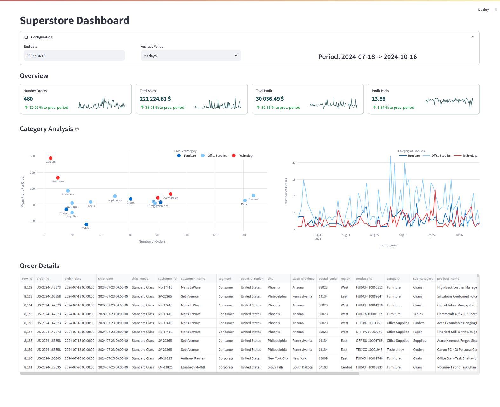

# Superstore Data

Streamlit Dashboard over Superstore Data stored in Postgres Docker container.

Data fetch with [SQLAlchemy](https://www.sqlalchemy.org/). Plots with [Plotly Express](https://plotly.com/python/plotly-express/).



## Install Python dependencies

Using [uv](https://docs.astral.sh/uv/):

```
uv sync
```

...or use your preferred environment manager with `pip install -r requirements.txt`. Generated with `uv pip compile pyproject.toml -o requirements.txt` so not tested on my side :D.

## Load data into Docker container

```sh
docker run --name superstore -p 5432:5432 -e POSTGRES_PASSWORD=postgres -d postgres
uv run ./docker/load_pg.py

docker stop superstore
docker start superstore
```

## Run

```sh
uv run -- streamlit run streamlit_app.py
```

## Resources

- https://www.kaggle.com/datasets/apoorvaappz/global-super-store-dataset
- https://www.tableau.com/blog/8-most-favorited-data-visualizations-tableau-public
- https://medium.com/@bolajioluwafunso/exploratory-data-analysis-of-global-superstore-using-tableau-34ec48c7a799
- https://www.phdata.io/blog/interactive-superstore-tableau-dashboard-example/
